# StifleR 2.14 Setup Guide

I'm creating this for my own records but sharing publicly as it might help others.  This is not official 2Pint documentation.  But if you need help, please do reach out to 2Pint Support.  

I'll be documenting my 2.14 Server Setup, following the 2.10 Guide from 2Pint:  https://stifler.docs.2pintsoftware.com/installation/server/stifler-server-installation


We'll be installing 4 componets on this single server:
- StifleR-Server
- StifleR-Dashboard
- WmiAgent (New in 2.14)
- ActionHub (New in 2.14)
  
## Pre-reqs

### Lab Server Info

- Server Name: 214-StifleR
- IP: 192.168.214.6
- OS: Server 2025 Standard w/ Desktop Experience
- Domain: 2p.garytown.com
- Web Server Cert from domain CA

### IIS Setup
I'll be enabling IIS on this server as I plan to run both the StifleR Server Service and the StifleR Dashboard on the same server.

```PowerShell
Install-WindowsFeature -Name Web-Server, Web-Windows-Auth -IncludeManagementTools
```

## StifleR Server Installation

This section will cover the simple installer and then launching of the configuration tools (new in 2.14) and a couple settings I'm setting in my lab.

### Stifler Server Installer

I'm going to start with launching the StifleR-Server-x64.msi and follow the prompts:

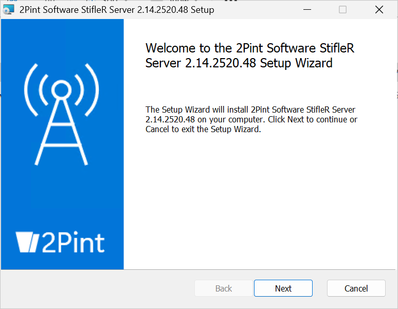
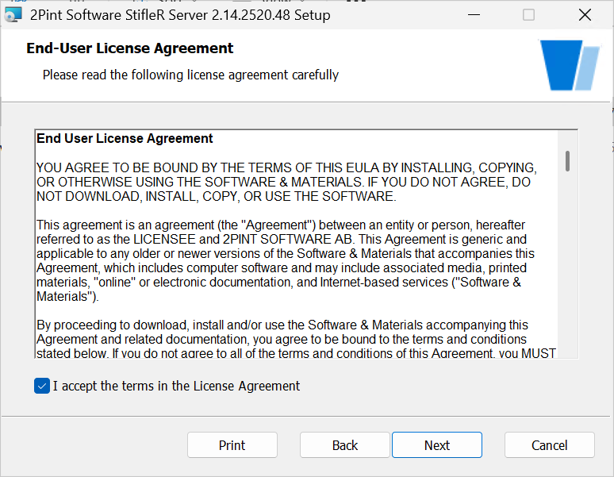
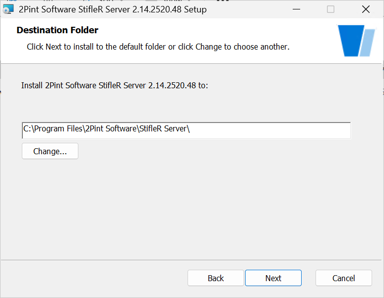
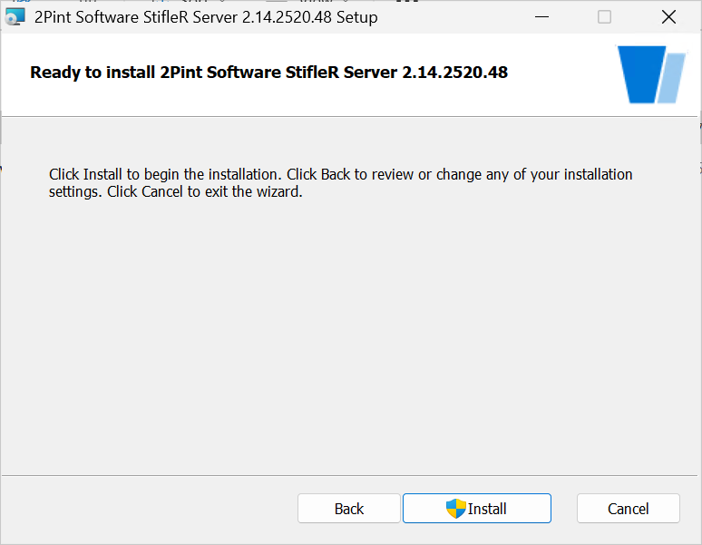
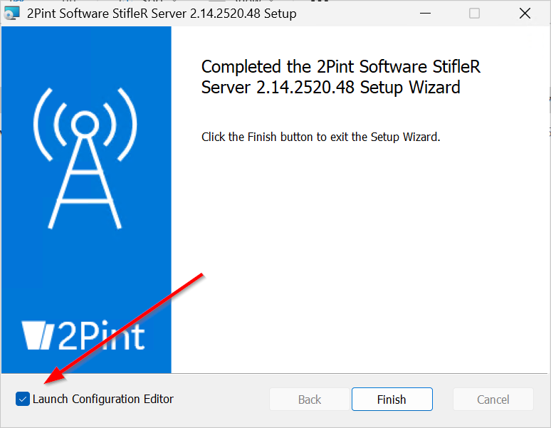

### StifleR Config

First I'm going to add my domain groups for the Admins and Read Access.  The Local Admins groups is there by default, remove or Keep, it's up to you, I left it alone.


Now I went down and added my license information, and the IIS Web Certificate thumbprint.

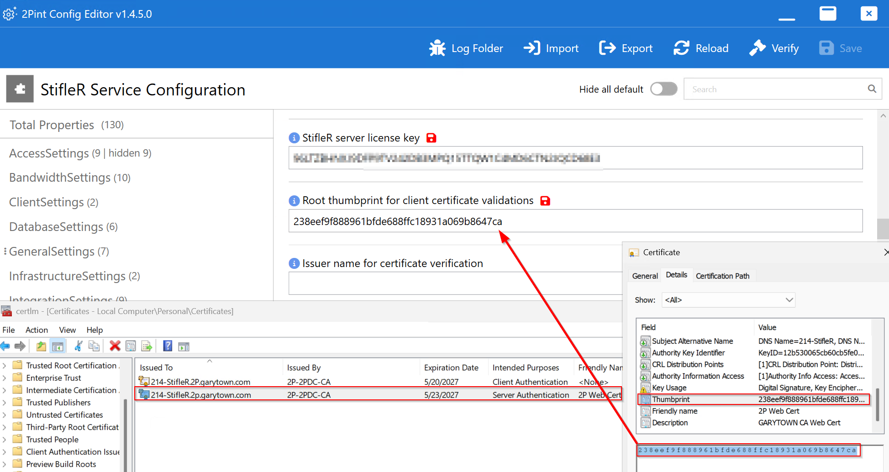

Further down, near the bottom, I added the same thumbprint for both places, I honestly don't know myself it that's correct, I'll update this later if it's not.

Then go ahead and click on Verify, and OK.
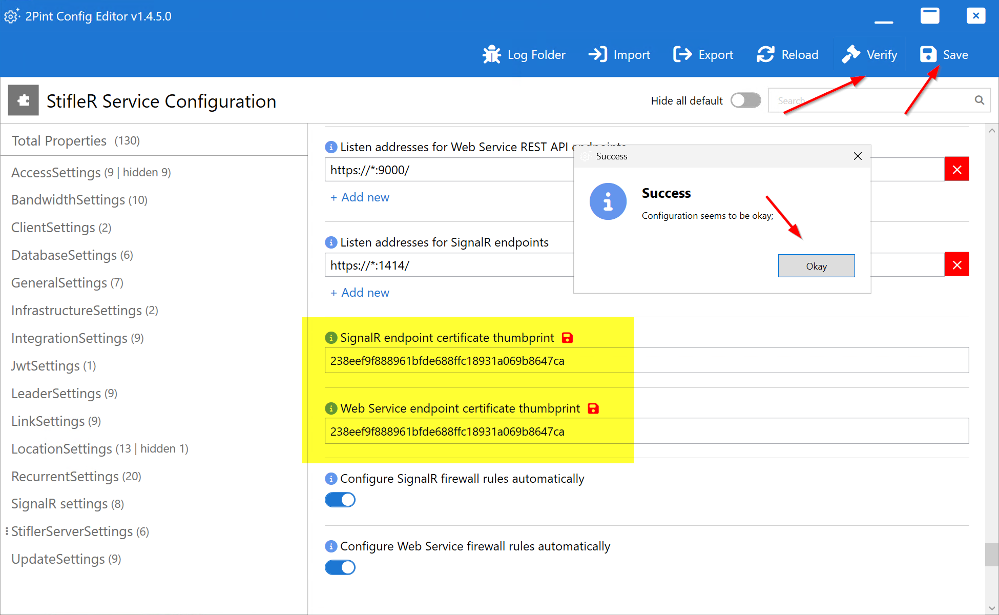

At this point, you'll want to click save, it will take a moment as it starts the service and you can confirm the service is started too.

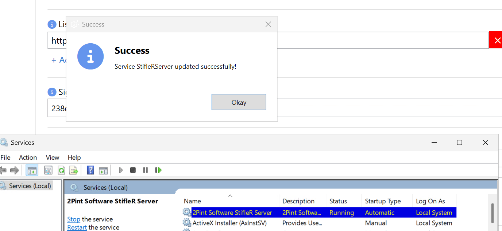

### StifleR Action Hub Install

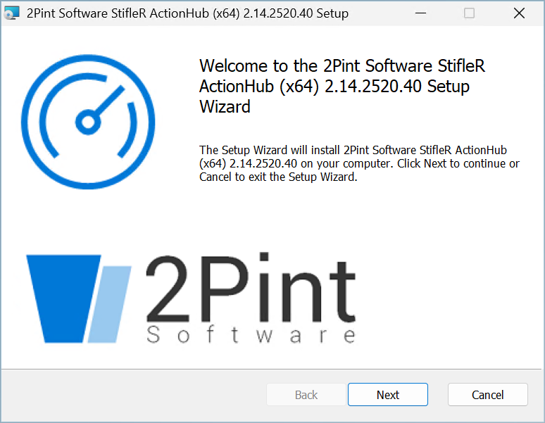
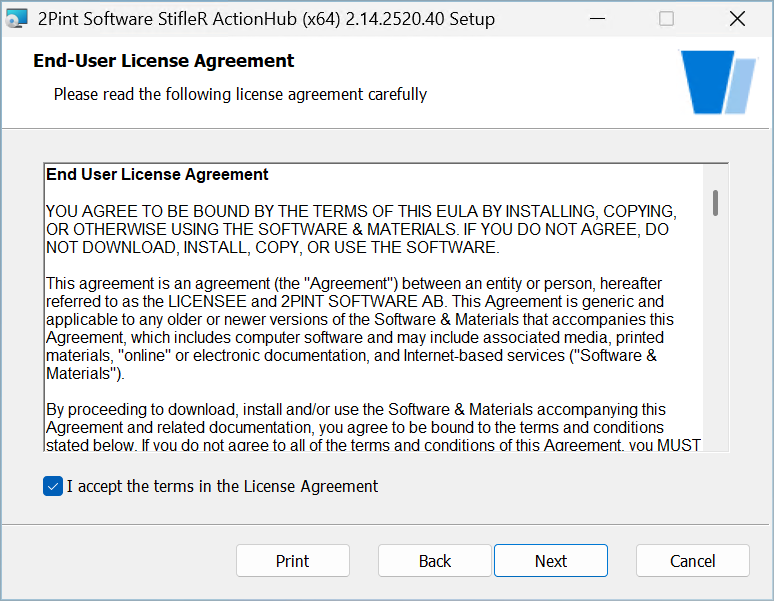
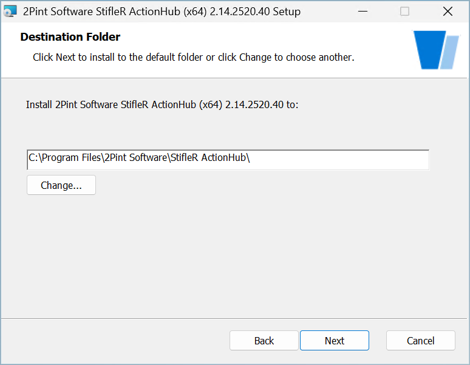
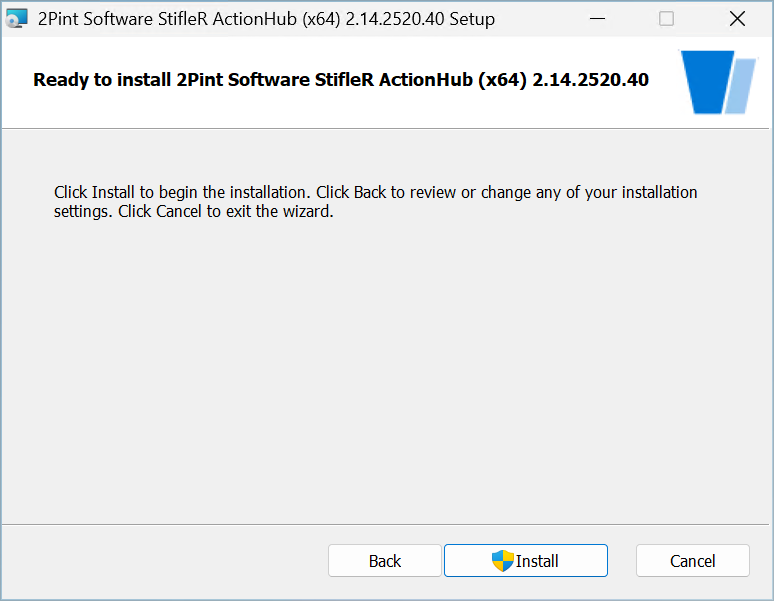
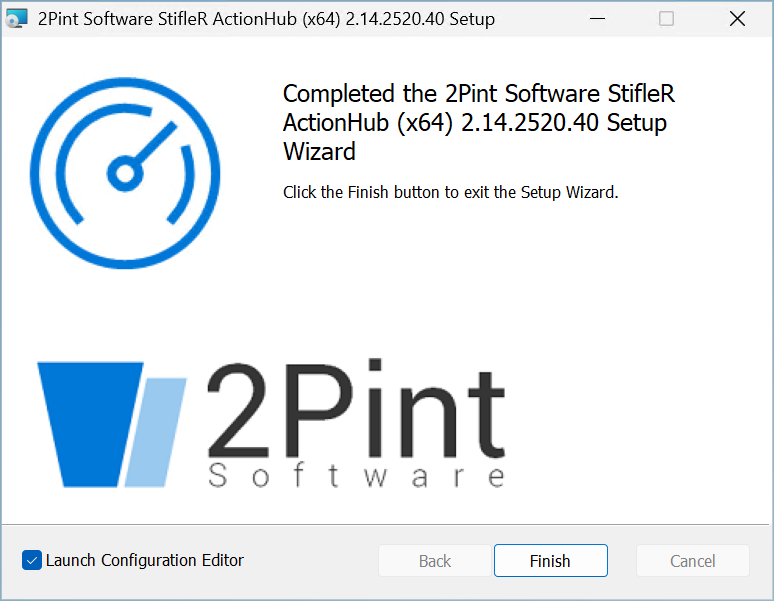

### StifleR Action Hub Config

So the only thing I changed was adding the server address with the ports:

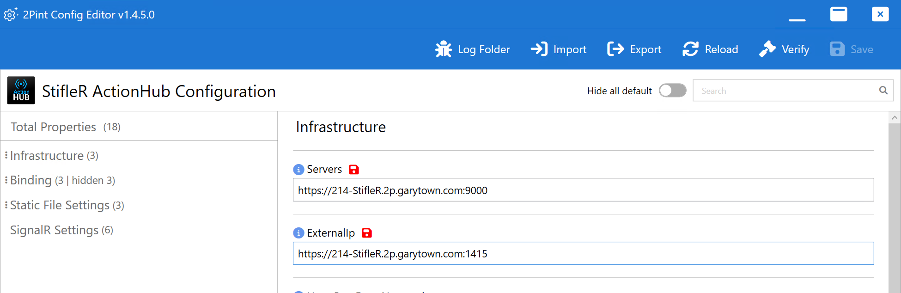

I then verified and saved.

### StifleR WMIAgent Install

I'm not taking images here, it's basically identical to the last ones, just click next on each one leaving the defaults and then wait for it to finish.

### StifleR WMIAgent Config

So there is just one setting, and you set it to your StifleR Server, so I add that plus the port 9000, and save.

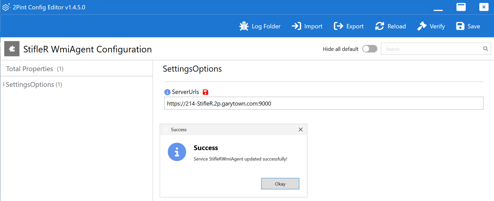

## StifleR DashBoard Installation

Now is the web portal component, which connects into the StifleR Server to surface everything and provide you a method to control the settings.

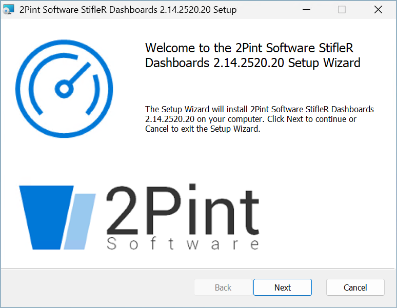

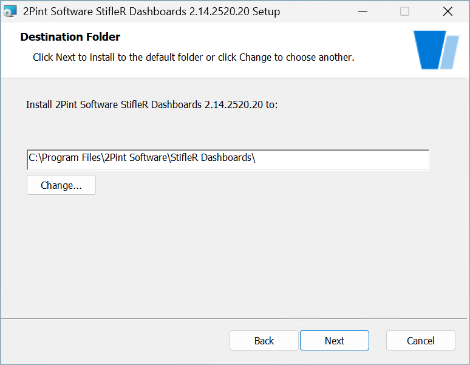

This is the only change I've done from the defaults, I've entered my server name:

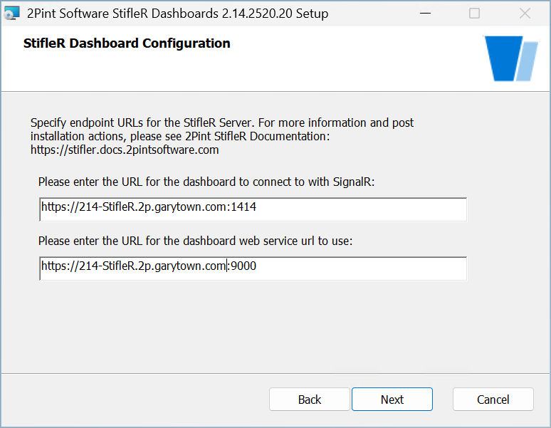
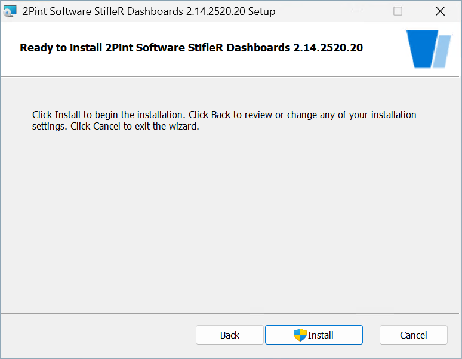

There is no configuration to do after, so at this point just make sure you've set your bindings for HTTPS in IIS and away we go:

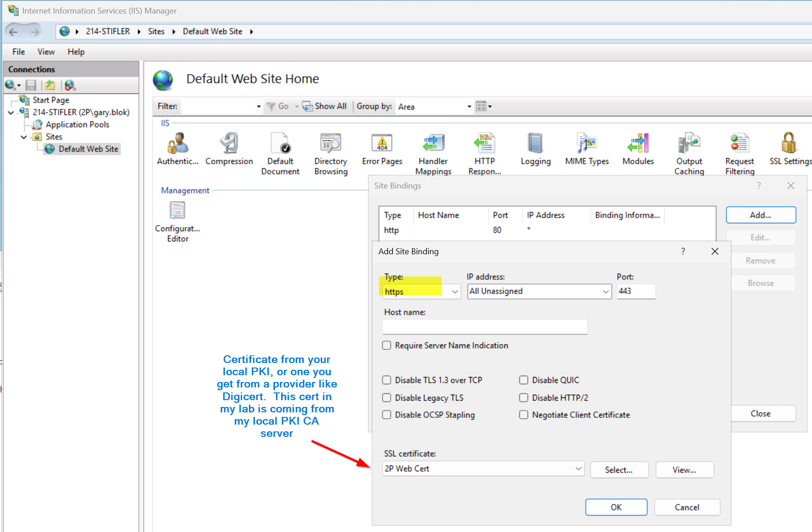

Ok, I can see that this installer didn't make the virtual directory, but I'm guessing future versions will, but for now, lets go ahead and create that.

```PowerShell
New-WebVirtualDirectory -Site "Default Web Site" -Name "StifleRDashboard" -PhysicalPath 'C:\Program Files\2Pint Software\StifleR Dashboards\Dashboard Files'
```

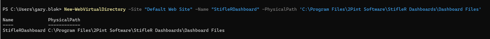

## Launch Dashboard:

For me the URL is: https://214-stifler.2p.garytown.com/StifleRDashboard

It will prompt for credintials, I'm going to use what I'm logged in as, which I know is also in the correct groups for permissions:


Once you're logged in, it will be a bit underwhelming, as you have no clients yet reporting in Data.  So the next thing... deploy your 2.14 clients.

