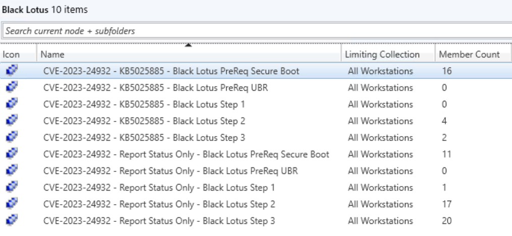
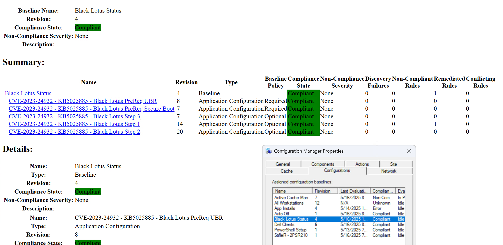
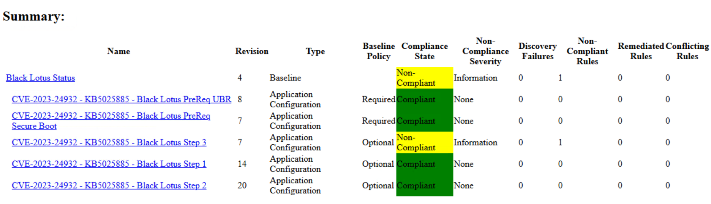

# KB5025885  - Black Lotus for ConfigMgr

- 25.5.13.13.6 - Updated ConfigMgr CI Scripts.  The Baseline & Scripts are all good to go
- 25.8.11.15.57 - You'll want to update the UBR info after import.  You can check the scripts here to see the change (July 2024 -> July 2025 requirement)
- 25.8.11.15.59 - Updated all of the individual scripts with the July UBR data

## NOTE
NOTE: Step 2 doesn't work in PowerShell ISE.  If you run launch PowerShell directly, or use VSCode, it works fine.
If you're testing manually, don't use PowerShell ISE

Two Baselines | Remediation | Monitoring

## Monitoring
Import the Black Lotus Monitoring.cab file to setup a read-only Baseline, which will just report back the status of each machine and their current status for each of the steps and pre-reqs

## Remediation

Import the Black Lotus Remediation.cab file to have everything setup for you, or create everything from scratch using the scripts, I suggest the import.

### Create Non-Compliant Collections

Run the script "KB5025885-CreateCMNonCompliantCollections.ps1" to create the collections.  You'll have to first connect to your CM environment in PowerShell before running.  If you're renamed the CIs, you'll need to update the script.  If you want to create Collections for both Baselines, you'll need to make slight modifications to the script to account for the different CI names.

In my console I've just created the collections for both Baseline's CI's that are Non-Compliant.  Most devices haven't reported in yet, but they are starting to, so you can see where they start to fall into buckets.

NOTE: The Remediation Baseline is configured differently than the Reporting Only Baseline.  
- Remediation Baseline will have a specific machine in only 1 state at a time, depending on where it is in the process.  So if it failed the pre-reqs, it won't show up in any other collection.
- The Reporting Baseline, a single device could fall into all 5 collections based on the device.  Ex:  A machine was just pulled off the shelf will a really old image, it might be non-compliant for the UBR status, and if a Tech disabled Secure Boot during troubleshooting, it would also fall into the Secure Boot non-compliant collection, and if no steps have been completed on that same device, it would fall into all three of the other collections.

Local Reports for machines at different stages:

