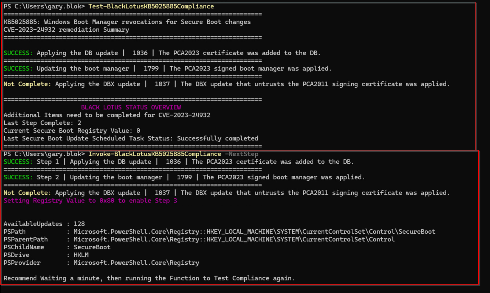
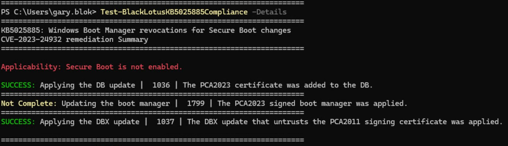

# KB5025885  - Black Lotus

I'll be keeping this updated with latest scripts for both ConfigMgr Configuration Items (CIs) and for Intune Remediation Scripts.  I'll also keep other useful scripts here.

I'll plan to create a change log, which will be listed on this page, once I get there.

Things are working, but I need to do a rewrite based on the May 5, 2025 changes Microsoft released.  The current scripts are based on the 2 reboots per step, which has now changed.  You can use them, but I will be updating soon... so stay tuned.

## References from Microsoft

- [How to manage the Windows Boot Manager revocations for Secure Boot changes associated with CVE-2023-24932](https://support.microsoft.com/en-us/topic/how-to-manage-the-windows-boot-manager-revocations-for-secure-boot-changes-associated-with-cve-2023-24932-41a975df-beb2-40c1-99a3-b3ff139f832d)
- [Enterprise Deployment Guidance for CVE-2023-24932](https://support.microsoft.com/en-us/topic/enterprise-deployment-guidance-for-cve-2023-24932-88b8f034-20b7-4a45-80cb-c6049b0f9967)
- [Updating Windows bootable media to use the PCA2023 signed boot manager](https://support.microsoft.com/en-us/topic/updating-windows-bootable-media-to-use-the-pca2023-signed-boot-manager-d4064779-0e4e-43ac-b2ce-24f434fcfa0f)
- [Secure Boot DB and DBX variable update events](https://support.microsoft.com/en-us/topic/secure-boot-db-and-dbx-variable-update-events-37e47cf8-608b-4a87-8175-bdead630eb69)
- [What's new in the ADK tools](https://learn.microsoft.com/en-us/windows-hardware/get-started/what-s-new-in-kits-and-tools)

## References from the Community

- [KB5025885: How to manage the Windows Boot Manager revocations for Secure Boot changes associated with CVE-2023-24932 – GARYTOWN](https://garytown.com/configmgr-task-sequence-kb5025885-how-to-manage-the-windows-boot-manager-revocations-for-secure-boot-changes-associated-with-cve-2023-24932)
- [KB5025885: Dealing with CVE-2023-24932 via Proactive Remediation & Configuration Items – GARYTOWN](https://garytown.com/kb5025885-dealing-cve-2023-24932-with-proactive-remediation-configuration-items)
- [Slightly clear the fog around BlackLotus mitigations - Red Pill Blogs](https://technet.blogs.ms/blacklotus/)

# Instructions

Each subfolder will have it's own readme with details, but things in this folder, I'll try to explain here.

## Test & Invoke BlackLotusKB5025885Compliance Scripts

These functions are created to help you check machines manually on an adhoc basis.
You can run these via the internet by launching powershell and invoking them with the command: iex (irm blacklotus.garytown.com) as shown below:

```PowerShell
PS C:\> iex (irm blacklotus.garytown.com)
[+] blacklotus.garytown.com 25.5.15.1
=========================================================
Black Lotus Functions
[+] Function Test-BlackLotusKB5025885Compliance (-Details)
[+] Function Invoke-BlackLotusKB5025885Compliance
[+] Function Update-BootMgr2023
```

- Test-BlackLotusKB5025885Compliance.ps1
  - This will give you an overview of the device and it's current status of Remediation for Black Lotus
  - -Details provides additional information about how the process works, and how you can manually trigger items

- Invoke-BlackLotusKB5025885Compliance.ps1
  - This function has several parameters, allowing control over which steps you want to enable, or trigger it to enable the next step in the process.  It will also allow you to trigger the scheduled task manually if you're impatiently watching the process, as I've found that the scheduled task doesn't run for 5-10 minutes after a reboot, so sometimes I just trigger it manaully to see the remediation take effect.



## Update Boot Manager

I wrote this to deal with an issue I saw when reimaging a device.  Situation was, I had a fully remediated device that I wanted to reimage.  I disabled Secure Boot, then reimaged with my older tooling.  Once reimaged, I fully patched the device and went to enable Secure Boot, but the device no longer booted. (See image below for Status, Step 1 & 3 complete, Secure Boot off)  I came to find out that reimaging the device and then patching did NOT update the BootMgr files with the 2023 cert, and still had the 2011 cert.  To resolve this, I wrote the script "Update-BootMgr2023.ps1 which will update the files in the System Volume with the correct files, you can then enable secure boot.

The Update-BootMgr2023 Script resolves a machine in this state:


# ConfigMgr Folder
You'll find a Baseline, along with the scripts that are in the exported baseline for reviewing.  There is also a Task Sequence Export (KB5025885 - Media Creator.zip) to use to update a boot.wim file, enabling the 2023 cert in your boot.wim file.  The Task Sequence to apply the Remediation can be found on my blog: https://garytown.com/configmgr-task-sequence-kb5025885-how-to-manage-the-windows-boot-manager-revocations-for-secure-boot-changes-associated-with-cve-2023-24932

# Intune Folder
This will contain scripts used with Intune Remediation feature.  I'll plan to have one script for a "Status Report" which will only be a detection script to give you an overview of devices and their remediation state.  I'll also provide scripts for performing steps 1-3, which you can control via a variable in the script.

# TO DO (Updated 25.5.13)

- Update Scripts for the May 5th Changes
  - Intune Remediation Scripts [Working on]

# Change Log

- 25.5.13 - Created readme page
- 25.5.13.13.6 - Updated ConfigMgr CI Scripts.  The Baseline & Scripts are all good to go
- 25.5.13.17.9 - Updated Intune Scripts, changed entire process.  Testing FullProcess Remediation Scripts in my lab currently.
- 25.5.14.10.58 - Added Update-BootMgr2023.ps1 file.  This is for when devices are reimaged while secure boot is disabled and the BootMgr doesn't get set to the 2023 signed version.
- 25.5.14.10.59 - Moved the Task Sequence "KB5025885 - Media Creator.zip" to this location.
- 25.5.15.12.26 - Reorganized folder structures and renamed items and updated this readme
