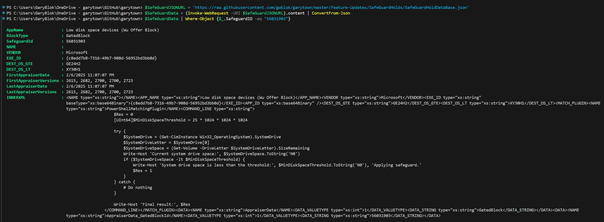
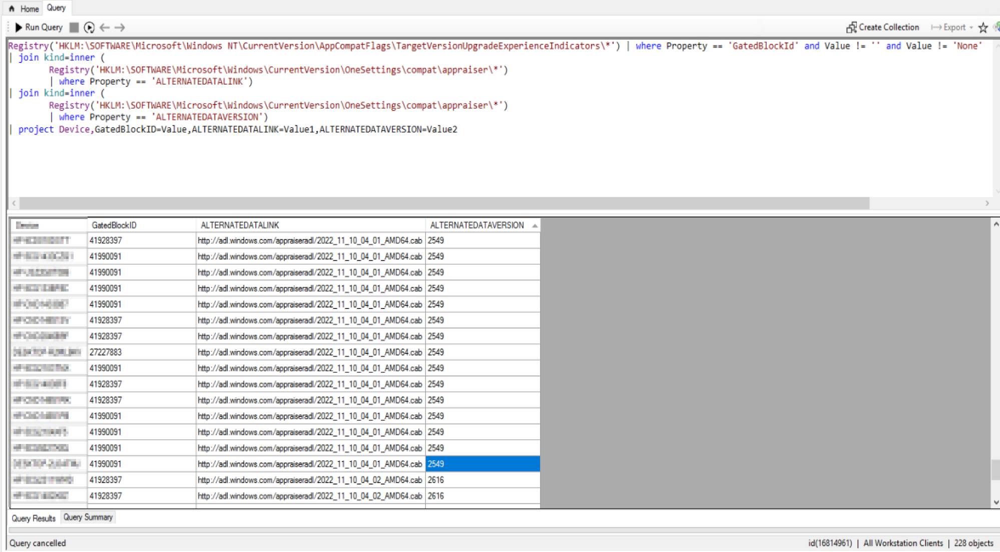
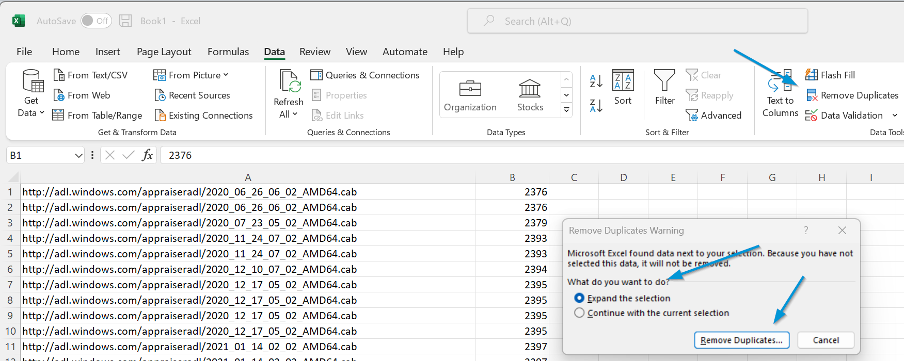
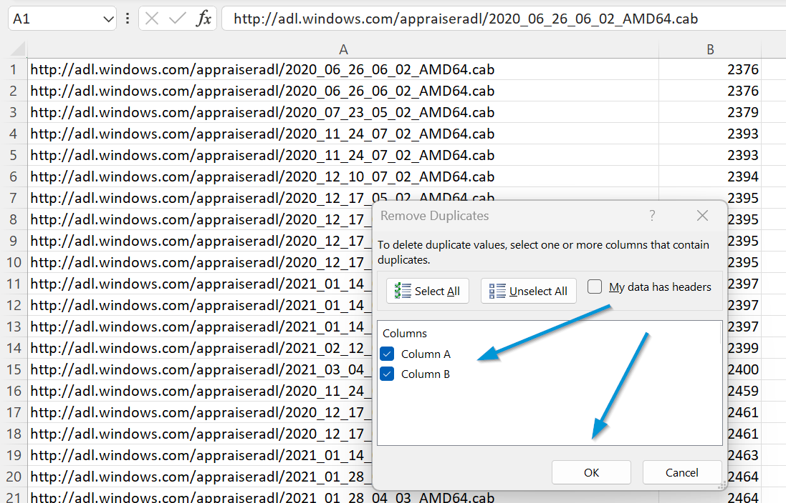
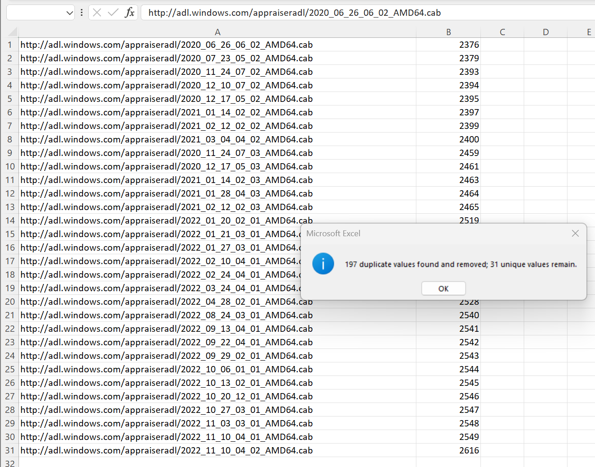
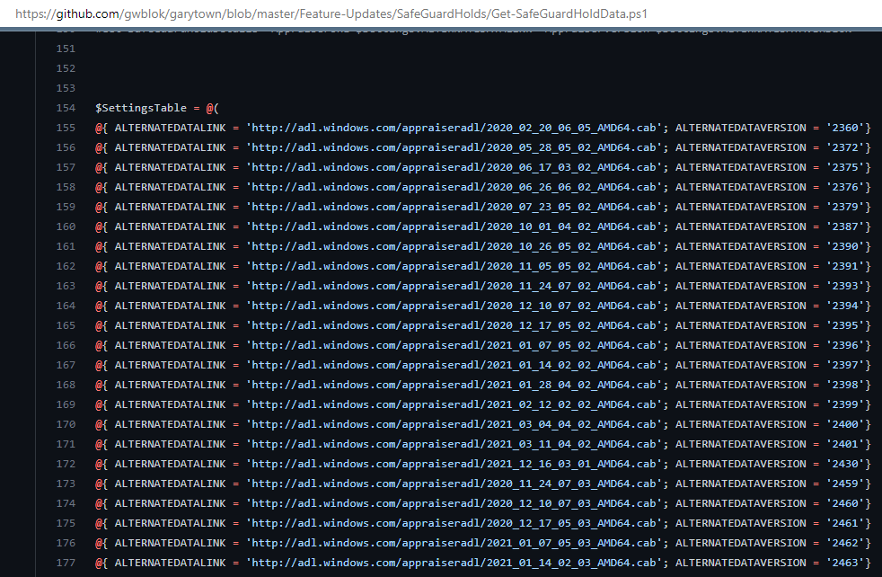
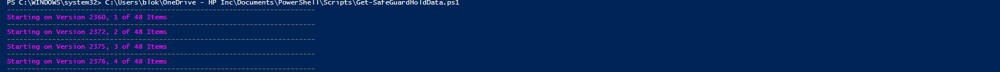
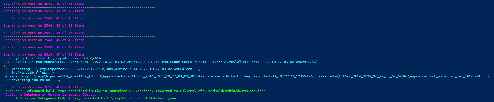

# Safeguard Hold Database - Community Ed

## TLDR

Information contained in JSON format in SafeGuardHoldDatabase.json file

Example PowerShell Commands:

```PowerShell
#This will set the URL for the JSON database
$SafeGuardJSONURL = 'https://raw.githubusercontent.com/gwblok/garytown/master/Feature-Updates/SafeGuardHolds/SafeGuardHoldDataBase.json'

#This creates a variable with the safeguard data
$SafeGuardData = (Invoke-WebRequest -URI $SafeGuardJSONURL).content | ConvertFrom-Json

#This will pull the information for the SafeGuard 56031903
$SafeGuardData | Where-Object {$_.SafeguardID -eq "56031903"}

```

[](media/Demo1.png)

## Updated 2025 Process to Build Database

Starting in 2025, the process to build the database was optimized and rebuilt to remove the requirement to pull data from endpoints.  Instead, the new method guesses URLS based on a pattern, and builds a list of ALL available URLS MS has published with Appraiser databases.  These URLs are saved to the file: SafeGuardHoldURLS.json

Once the URLs are created, it will run through the URLs and do the following:

- Download CABs
- Expand SDBs from CABs
- Convert SDB to XML - Process Requires the sdb2xml.exe file.
- Parse Appraiser Data
- Remove Duplicate Blocks
- Creates the SafeGuardHoldDatabase.json file

## Database Safeguard Hold ID Count: 356 | 2025.02.10

# OLD Information Below.... just a reference of how to do it specifically for your own environment

I've built this database for my own use, but have published the data as well as the method I used to build it.  Thanks Adam Gross for laying the foundation:
Based on <https://github.com/AdamGrossTX/FU.WhyAmIBlocked/blob/master/Get-SafeguardHoldInfo.ps1>

## Getting Required Data for Building Database

Basically I ran this in my environment:

### CMPIVOT Query

``` powershell
<#
Registry('HKLM:\SOFTWARE\Microsoft\Windows NT\CurrentVersion\AppCompatFlags\TargetVersionUpgradeExperienceIndicators\*') | where Property == 'GatedBlockId' and Value != '' and Value != 'None'
| join kind=inner (
  Registry('HKLM:\SOFTWARE\Microsoft\Windows\CurrentVersion\OneSettings\compat\appraiser\*') 
  | where Property == 'ALTERNATEDATALINK')
| join kind=inner (
  Registry('HKLM:\SOFTWARE\Microsoft\Windows\CurrentVersion\OneSettings\compat\appraiser\*') 
  | where Property == 'ALTERNATEDATAVERSION')
| project Device,GatedBlockID=Value,ALTERNATEDATALINK=Value1,ALTERNATEDATAVERSION=Value2
#>
```

[](media/CMPivot.png)

### Excel Cleanup

I'll copy the URLs (ALTERNATEDATALINK) & Versions (ALTERNATEDATAVERSION) into Excel, Sort & Remove Duplicates:

[](media/RemoveDups.png)
[](media/RemoveDups2.png)
[](media/RemoveDups3.png)

### Compare with Current List of URLS / Versions

Then Compare with the [build script](https://github.com/gwblok/garytown/blob/master/Feature-Updates/SafeGuardHolds/Get-SafeGuardHoldData.ps1).

[](media/BuildScript.png)

### Send me any additional items you have or do a Pull Request

If you find URLs and Versions which I do not have listed, please send them to me (@gwblok on Twitter), and I'll add those and rebuild the database with anything additional that gets added.

The database is a JSON file for easy ingestion.  I have a PowerShell Sample script you can use as a template to look up the Safeguard Hold IDs easier.

## If you would like to run the script yourself for fun

Running the Script can take awhile as it has to export the SDB files into XML.  It only has to do this once per Version, so if you've run the script before and export to XML, if it finds the coorisponding XML, it will move to the next one

[](media/RunScript1.png)
[](media/RunScript2.png)

Hit me up on Twitter with any questions.
