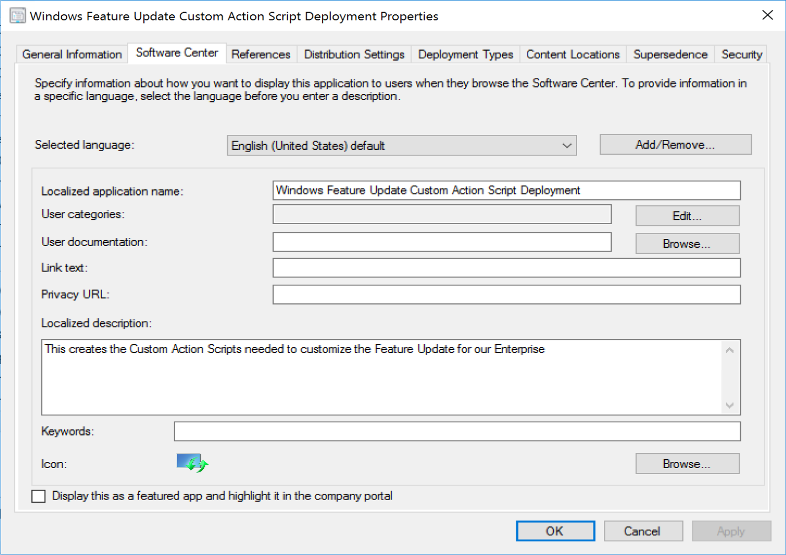
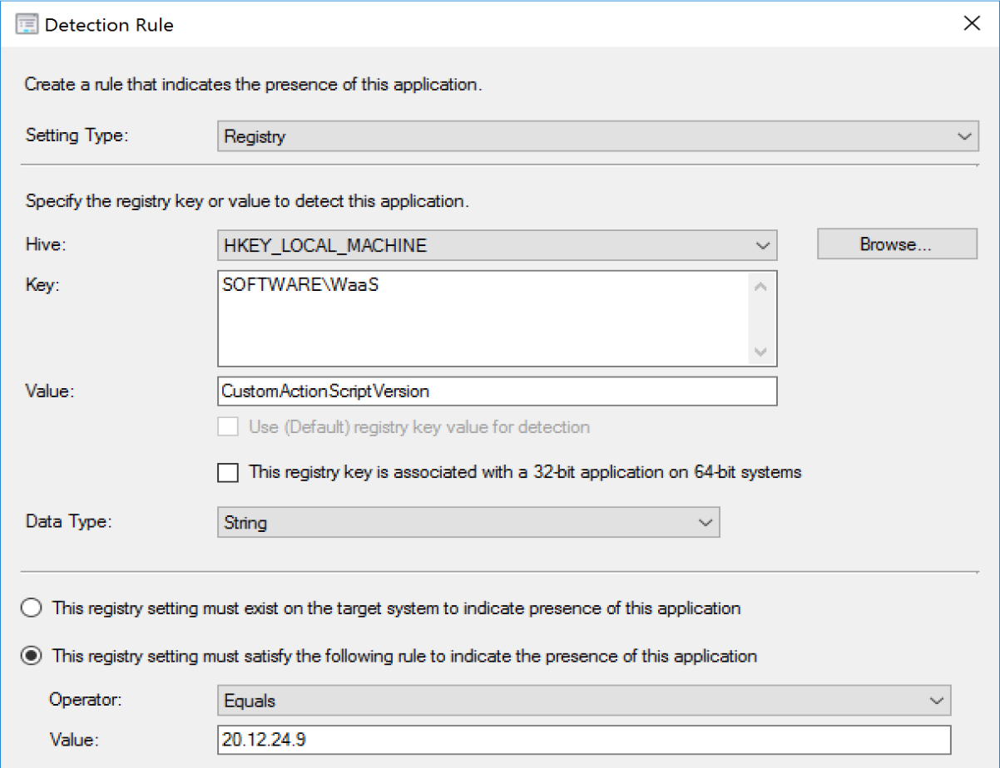
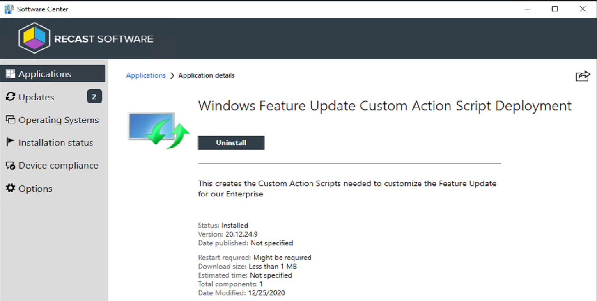
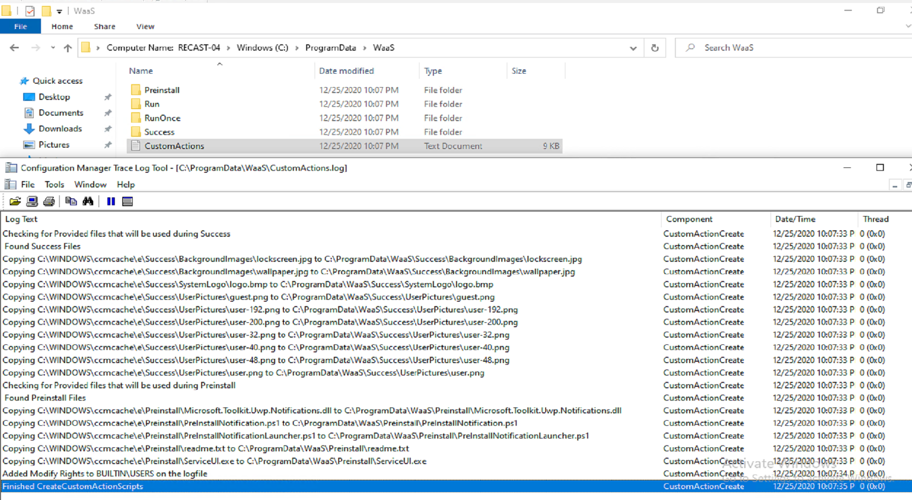
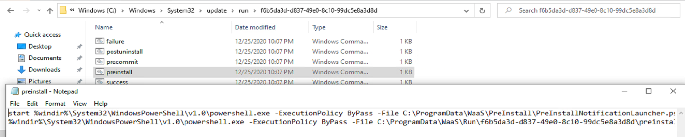
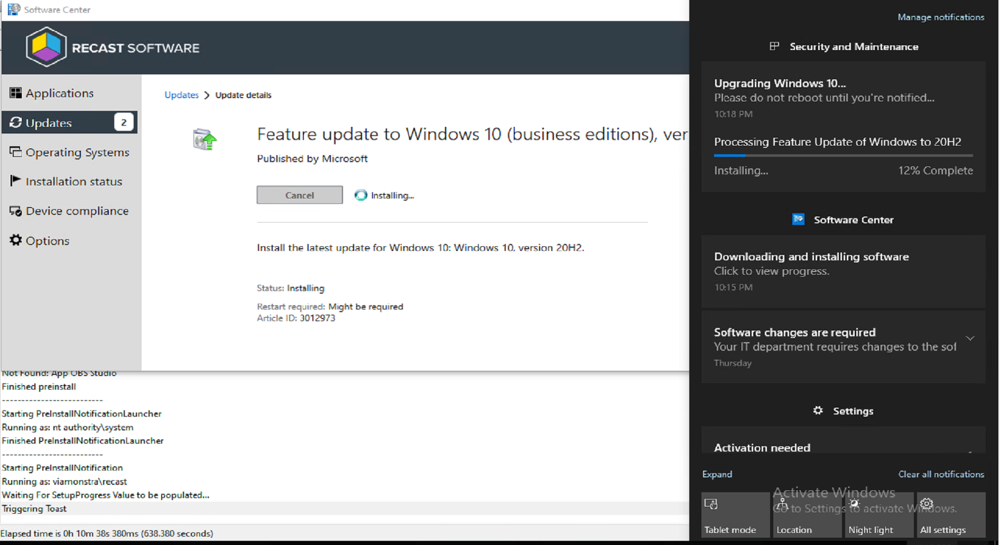
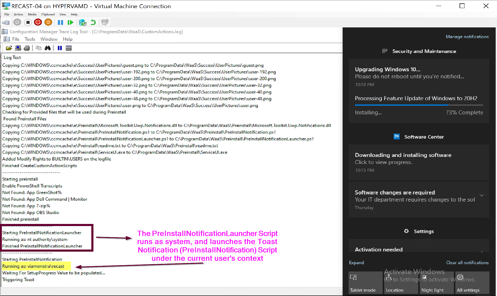
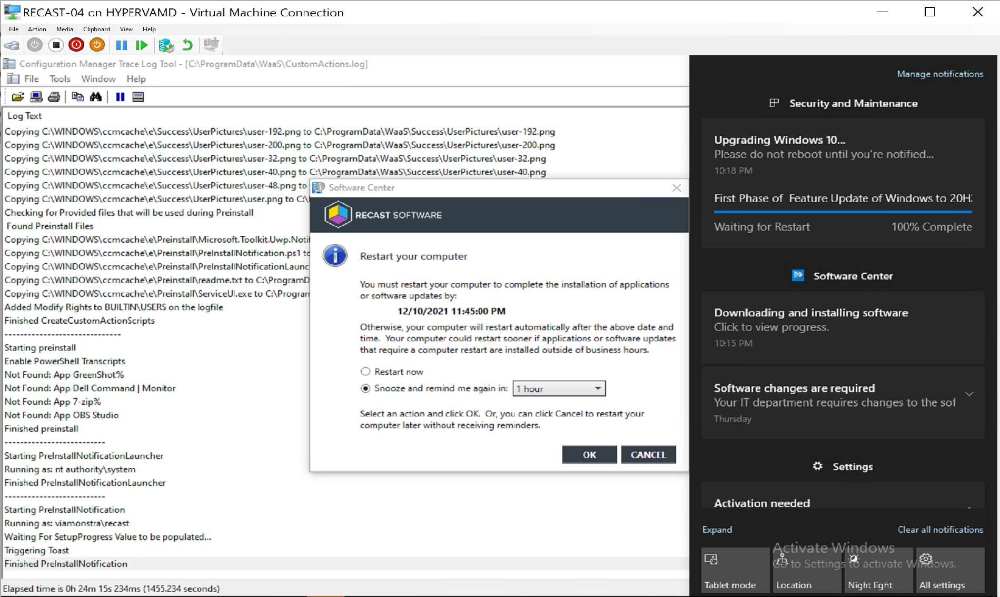

# Feature Updates

This area will be dedicated to Feature Updates.  
Most of the documentation will be available on [Recast Docs](https://docs.recastsoftware.com/ConfigMgr-Docs/index.html)

## SetupConfig.ini

Coming soon... and will be intergrated into the ConfigMgr App talked about below.

## Custom Actions

Custom action Scipts allow you to run scripts during the setup engine, allowing customizations and so much more.  I've created a ConfigMgr App that you can run on a machine that will setup everything for you, just replace with your own items.

To learn much much more about custom actions, go here: [Recast Docs Client Actions](https://docs.recastsoftware.com/ConfigMgr-Docs/Windows-Servicing/Windows-Setup-Custom-Action-Scripts.html)

## ConfigMgr App

The ConfigMgrApp is the contents of the app I use to populate Custom Action Scripts for Feature Updates.  It also contains the Toast Notification that displays the Setup Engines % Complete, which is triggered by the PreInstall.cmd Custom Action Script.

App Name: Windows Feature Update Custom Action Script Deployment  
App DT Name: Custom Action Scripts
Software Version: Whatever the script says, make sure it matches.  
Install Program:

```
powershell.exe -ExecutionPolicy ByPass -WindowStyle Hidden .\CreateCustomActionScripts.ps1
```

Uninstall Program:

```
cmd.exe /c reg delete HKLM\Software\WaaS /v CustomActionScriptVersion /F
```

> [!NOTE]
> All of my scripts, including the App Install Script are setup to log to c:\programdata\waaS\CustomActions.log

The App in the Console:  
[](media/FeatureUpdates01.png)
The Detection Method needs to match the Version of the Script, as when the script runs, it stamps the version in the registry for reporting and detection.  
[](media/FeatureUpdates09.png)
[](media/FeatureUpdates10.png)
The App in Software Center:  
[](media/FeatureUpdates02.png)
After Install, c:\ProgramData\WaaS is populated with scripts and files that get called by the custom action scripts.  
[](media/FeatureUpdates03.png)
It also creates the scrips in the Run & RunOnce locations, which then call the powershell scripts to do additional items.  
[](media/FeatureUpdates04.png)
When the Feature Update launches, the PreInstall.cmd triggers a chain of events that launch a toast notification to allow you to track the progress of the setup engine.
[](media/FeatureUpdates05.png)

After the default time (typical 5-7 seconds),the toast dismisses to the Action Center, but it continues to update the progress keeping you informed of the feature update process.
[](media/FeatureUpdates06.png)
All of the scripts log items, and in this example, you can see that it launches the Toast under the user's context.
[](media/FeatureUpdates07.png)
The toast updates its messages a few times during the process, as the end it lets you know it's complete and waiting for restart, I still need to tweak the text to fit, as you can see:  
[](media/FeatureUpdates08.png)
This App also copies down our corporate wallpaper and lockscreen images and replies them during the Success.cmd Custom Action.  Some other examples are built in, so if you're looking to start leveraging custom actions, between this application and docs on Recast Docs, you should have a good start.
