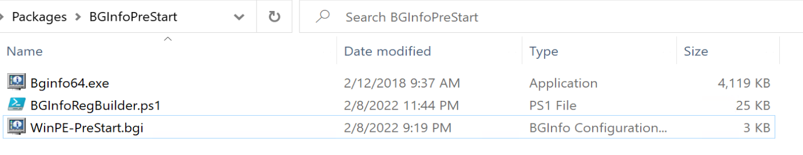
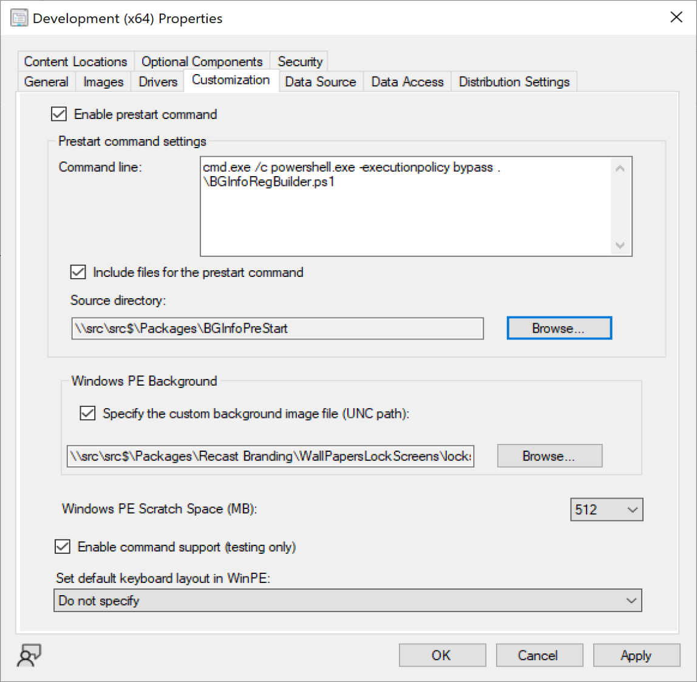

# BGInfo for ConfigMgr OSD - Prestart Command

## Prestart Commands
cmd.exe /c powershell.exe -executionpolicy bypass .\BGInfoRegBuilder.ps1

## Folder
- Bginfo64.exe
- WinPE-PreStart.bgi
- BGInfoRegBuilder.ps1

