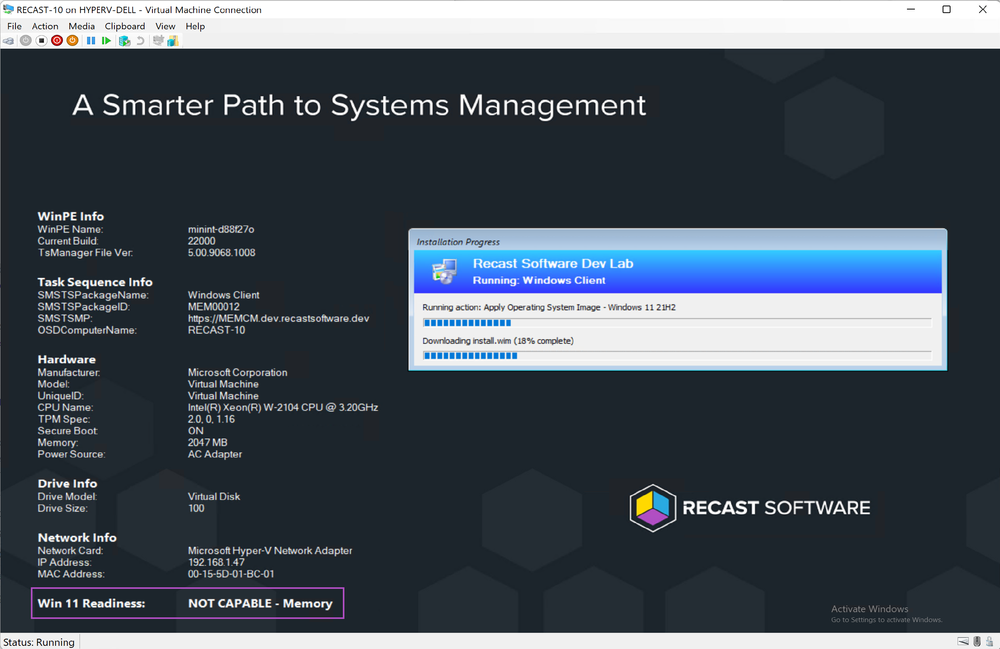
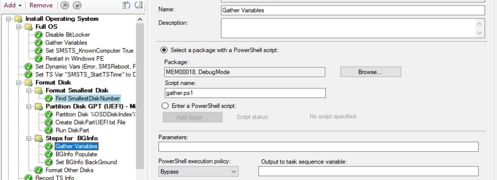
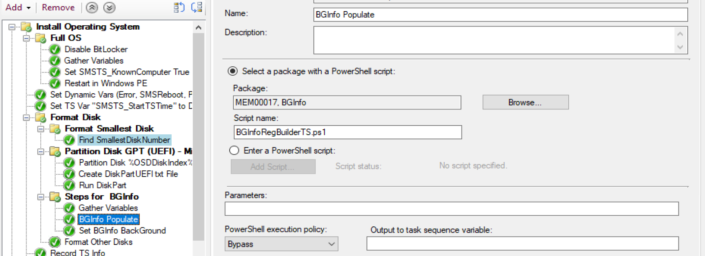
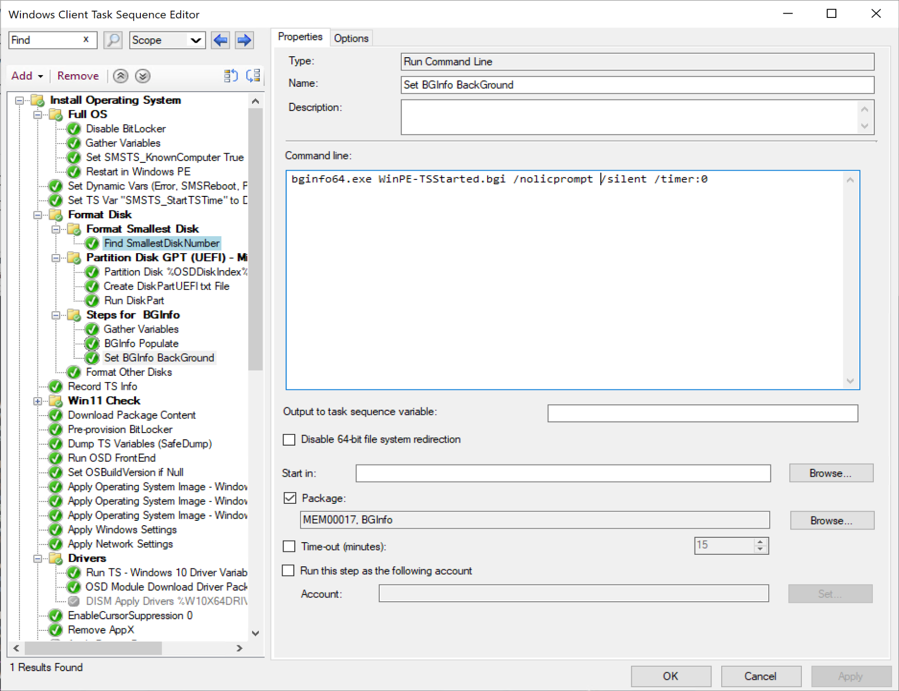

# BGInfo for ConfigMgr OSD - Prestart Command

## Prestart Commands
cmd.exe /c powershell.exe -executionpolicy bypass .\BGInfoRegBuilder.ps1

## TS Run Command Line Step to Trigger BGInfo
bginfo64.exe WinPE-TSStarted.bgi /nolicprompt /silent /timer:0

## Folder
- Bginfo64.exe
- WinPE-PreStart.bgi | Used during Pre-Start
- BGInfoRegBuilder.ps1 | Used during Pre-Start
- WinPE-TSStarted.bgi | Used once Task Sequence has started, after Gather Step
- BGInfoRegBuilderTS.ps1 | Used once Task Sequence has started, after Gather Step

## Updates
- 2022.02.09 - Added additional Fields (Manufacturer, Model, UniqueID)
- 2022.02.09 - Added 2nd set of files for Once the TS Starts, requires Gather Step run.
  - https://github.com/gwblok/garytown/blob/master/OSD/gather.ps1

### Pre-Start

### In Task Sequence

### Source Folder

### Boot Media

## In the Task Sequence

