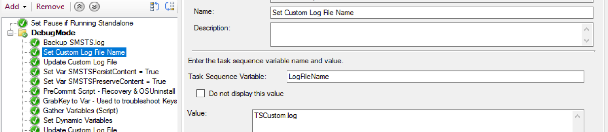
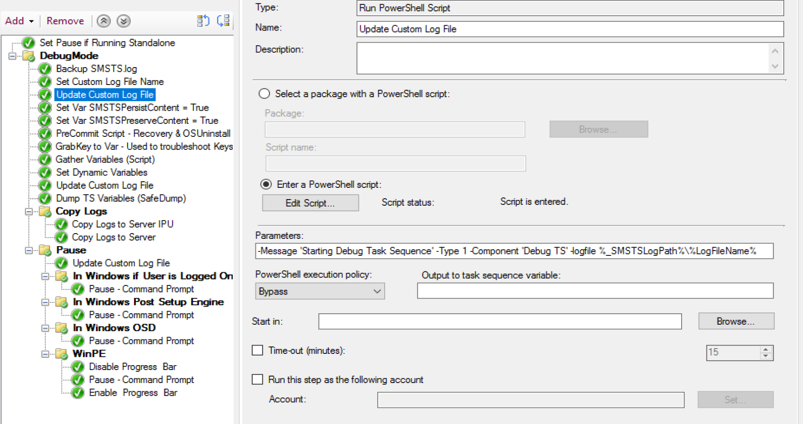
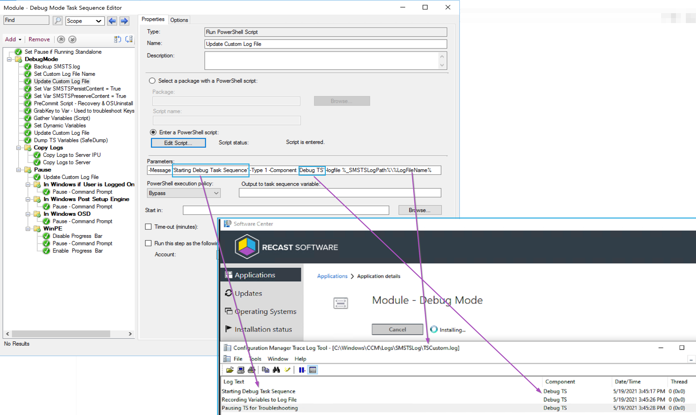

# Task Sequence Custom Logging Steps

Not saying this should be your main way for custom logging, but it's been really helpful in a pinch.

This code is 100% stolen from Ryan: https://www.ephingadmin.com/powershell-cmtrace-log-function and used in a unique way.

## In the Task Sequence

## Demo

