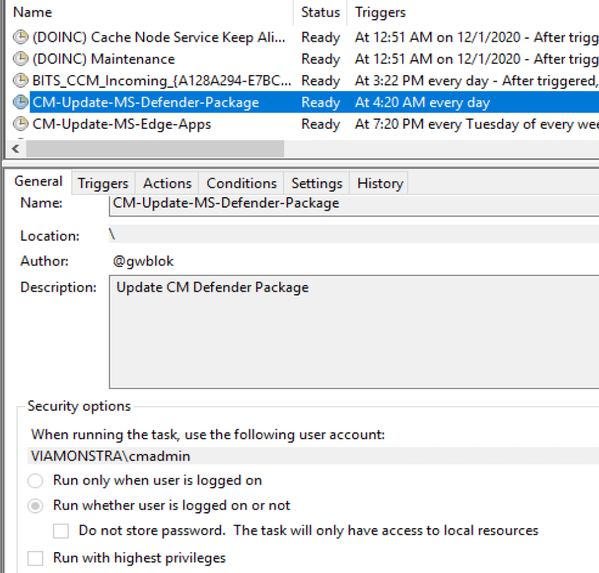
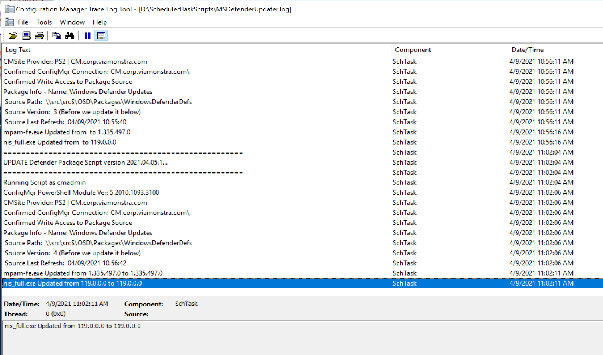
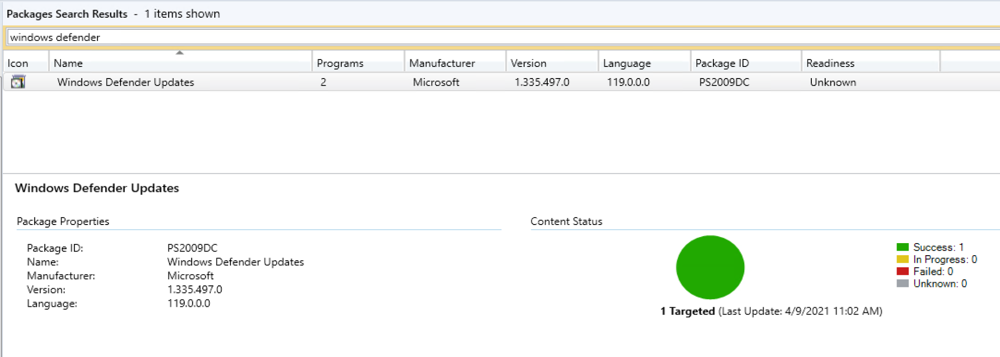

# Windows Defender Package Update Automation

Based on Johan's Script & [Jorgen's Blog](https://ccmexec.com/2016/01/download-and-deploy-windows-defender-definitions-for-windows-10-during-osd/)

Includes Scheduled Task that runs daily & Script that updates a package.

To use:
- Decide where you want to store the script.
- Update the XML for the Scheduled task to where you store the script
- Import the Scheduled Task, leverage a gSMA account or other service account with permissions to both CM & the Package Location

## Scheduled Task:
```
In my lab, I'm just using a user account, but in Production, I'm using a gSMA account.
```

[](DefenderUpdate01.png)

## Log File:

[](DefenderUpdate02.png)

## Package in Console:

[](DefenderUpdate03.png)
