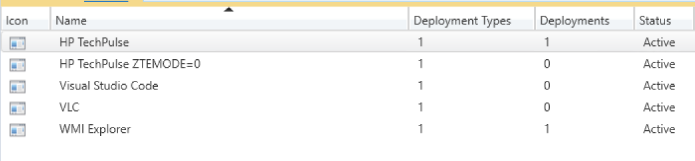
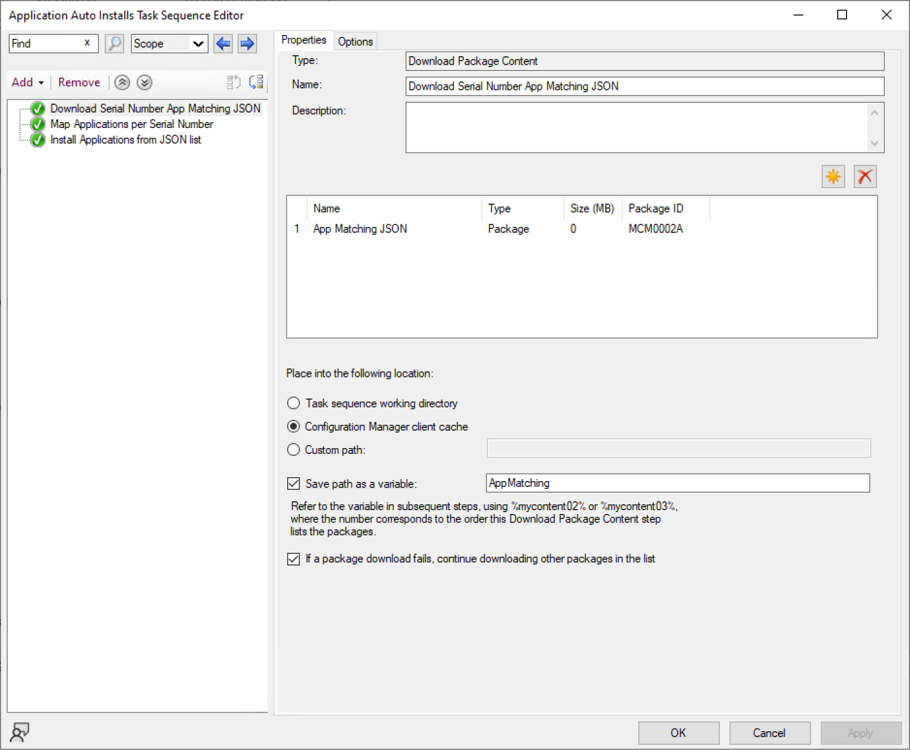
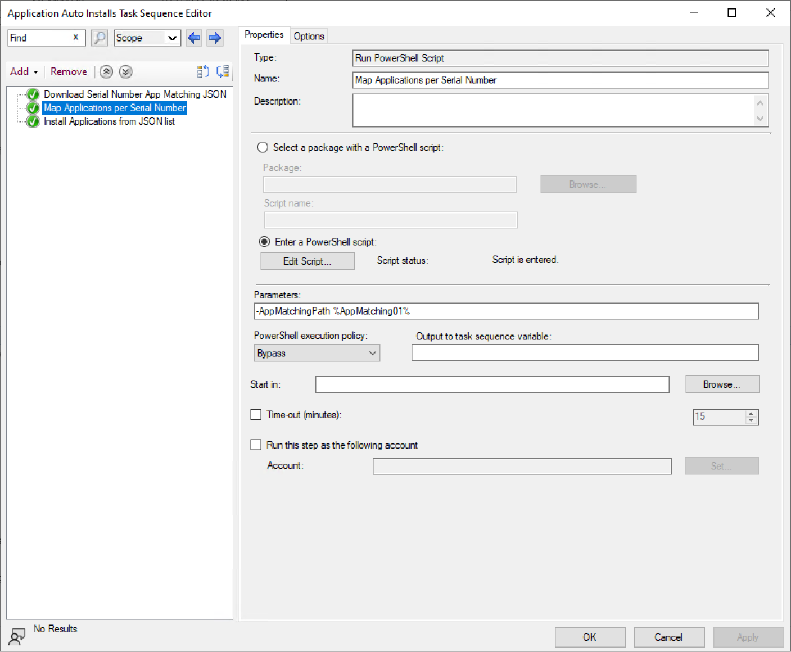
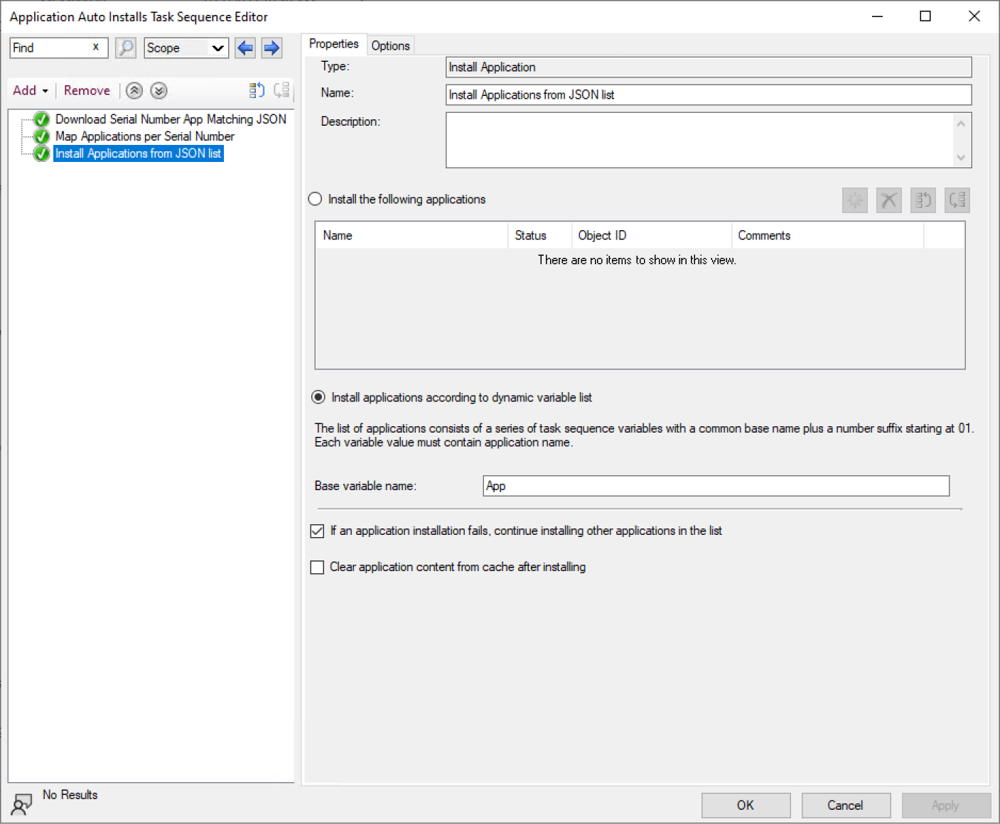
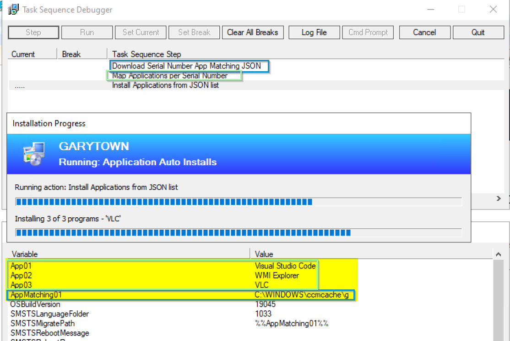
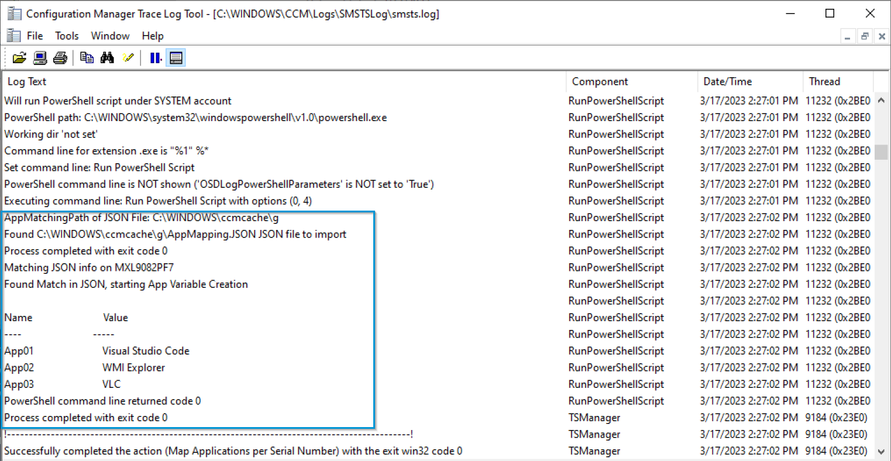

# Module for App Mapping based on JSON File

Gives the code needed to build variables to have Task Sequence dynamically install applications

Export = Task Sequence (It's the ZIP File)

JSON File: NOTE, the Apps MUST match the Names of the Apps in ConfigMgr
``` JSON

[
    {
        "ComputerName": "HP-PD-600-G4",
	"SerialNumber": "MXL9082PF7",
        "Apps": ["Visual Studio Code", "WMI Explorer", "VLC"]
    },
    {
	"ComputerName": "HP-ED-800-G6",
        "SerialNumber": "MXL2521TYG",
        "Apps": ["HP TechPulse", "Visual Studio Code", "WMI Explorer", "VLC"]
    }
]
```


PowerShell Script:
``` PowerShell
[CmdletBinding()]
Param (
		[Parameter(Mandatory=$false)]
		$AppMatchingPath# = "\\src\src$\Packages\AppMapping"
	)

if ($AppMatchingPath){
    Write-Output "AppMatchingPath of JSON File: $AppMatchingPath"    
    $AppMatchingFile = Get-ChildItem -path $AppMatchingPath -Filter *.JSON

    if ($AppMatchingFile){
        Write-Output "Found $($AppMatchingFile.FullName) JSON file to import"
        try {
            $AppMapping = Get-Content -Path $AppMatchingFile.FullName | ConvertFrom-Json
            }
        catch {
            Write-Output "Failed to import JSON"
            Get-Content -Path $AppMatchingFile.FullName | ConvertFrom-Json
            exit 1
        }
        $SerialNumber = (Get-WmiObject win32_bios).Serialnumber
        Write-Output "Matching JSON info on $SerialNumber"
        $MatchingApps = ($AppMapping | Where-Object {$_.SerialNumber -match $SerialNumber}).Apps
        if ($MatchingApps){
            Write-Output "Found Match in JSON, starting App Variable Creation"
            $Counter = 1

            # Connect to TS Environment
            $tsenv = New-Object -COMObject Microsoft.SMS.TSEnvironment

            #Loop through Apps       
            foreach ($App in $MatchingApps){
                $Number = "{0:D2}" -f $Counter
                New-Variable -Name "App$($Number)" -Value $App
                $tsenv.Value("App$($Number)") = $App
                $Counter ++
                #Record Variable Name & Value to SMSTSLog
                Get-Variable -Name "App$($Number)"
            }
        }
    }
    else {
        Write-Output "Did not find a JSON File in $AppMatchingPath"
    }

}
else {
    Write-Output "No AppMatchingPath Provided"
}
```








