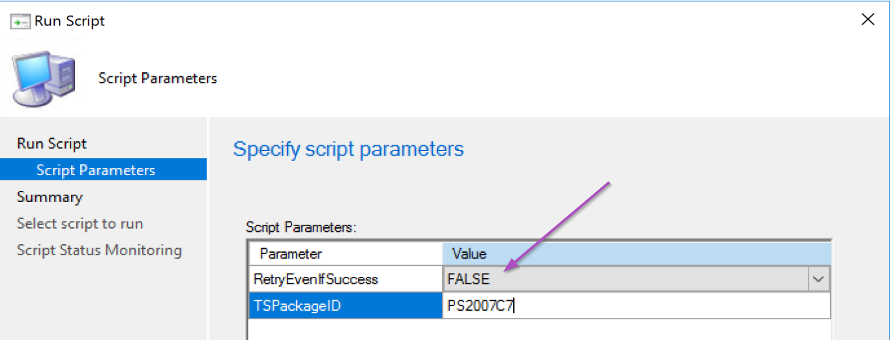
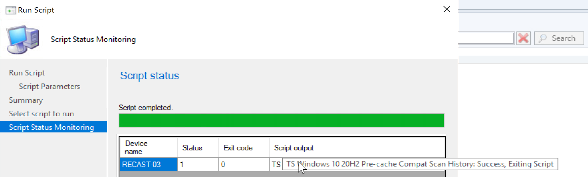
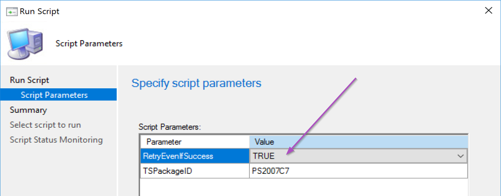
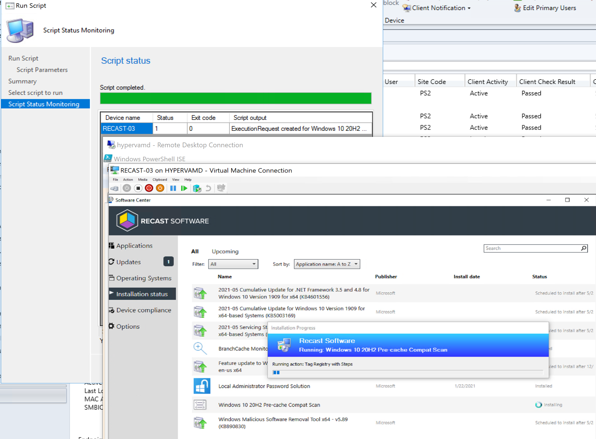

# Start-TaskSequence

This script is meant to be used as a RunScript in ConfigMgr, however you can steal the code for whatever you want.

There is a switch in the script that checks the execution history for the task sequence, if already successfully ran, will exit out of the script.  You can override this by switching to "TRUE".

## Demos

### Demo - Already Successfully Ran Previously - Exit Script

### Demo - Already Successfully Ran Previously - Force Re-run

