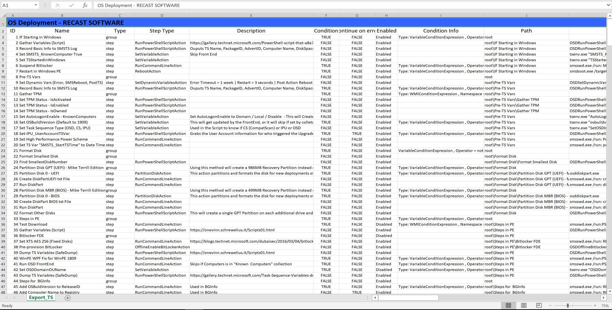
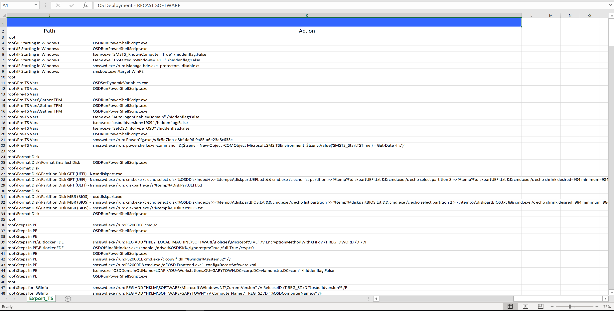
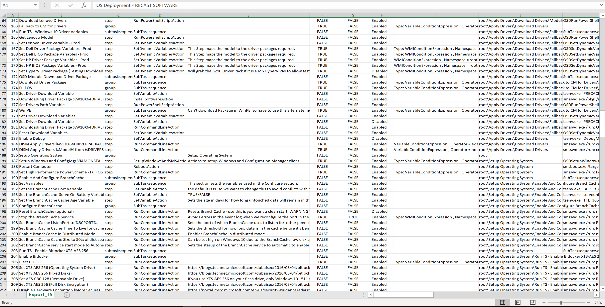

# Task Sequence Steps to Excel

Updated again, completely wrote it over making functions to make future scripts easier.

Now it will create a Excel Doc with 3 sheets

- General Info about TS
- TS reference Items
- TS Steps

Also created a script that will dump info about Boot Images

